# Схема зв'язків / ER Diagram — Pharma Sales star schema

Модель побудована як **star / constellation schema** (Kimball): 5 фактових таблиць
розділяють спільні (conformed) виміри. Виміри — SCD Type 2 (крім `DimDate`).
Факти посилаються на **durable-ключі** вимірів (`SK*KeyID`), а не на surrogate-ключі версій.

> GitHub рендерить діаграму Mermaid нижче автоматично. Локально можна переглянути через
> будь-який Mermaid live-редактор або розширення VS Code "Markdown Preview Mermaid Support".

## Зоряна схема (зв'язки фактів і вимірів)

```mermaid
erDiagram
    DimDate            ||--o{ FctSales              : "SKDateKeyID"
    DimEmployee        ||--o{ FctSales              : "SKEmployeeKeyID"
    DimClientAccount   ||--o{ FctSales              : "SKClientAccountKeyID"
    DimProduct         ||--o{ FctSales              : "SKProductKeyID"

    DimDate            ||--o{ FctSalesPlan          : "SKDateKeyID"
    DimEmployee        ||--o{ FctSalesPlan          : "SKEmployeeKeyID"
    DimProduct         ||--o{ FctSalesPlan          : "SKProductKeyID"

    DimDate            ||--o{ FctVisit              : "SKDateKeyID"
    DimEmployee        ||--o{ FctVisit              : "SKEmployeeKeyID"
    DimClientAccount   ||--o{ FctVisit              : "SKClientAccountKeyID"
    DimActivityType    ||--o{ FctVisit              : "SKActivityTypeKeyID"

    DimDate            ||--o{ FctTargetFrequency    : "SKDateKeyID"
    DimEmployee        ||--o{ FctTargetFrequency    : "SKEmployeeKeyID"
    DimClientAccount   ||--o{ FctTargetFrequency    : "SKClientAccountKeyID"
    DimActivityType    ||--o{ FctTargetFrequency    : "SKActivityTypeKeyID"

    DimDate            ||--o{ FctInventorySnapshot  : "SKDateKeyID"
    DimClientAccount   ||--o{ FctInventorySnapshot  : "SKClientAccountKeyID"
    DimProduct         ||--o{ FctInventorySnapshot  : "SKProductKeyID"

    DimDate {
        int    SKDateKeyID PK
        date   DateValue
        int    YearMonth
        int    Quarter
        bit    IsWeekend
    }
    DimEmployee {
        bigint SKEmployeeKeyID PK "durable key"
        bigint SKEmployeeID "SCD2 version PK"
        string Name
        string ProfileName
        string RegionName
        datetime StartDate
        datetime EndDate
    }
    DimClientAccount {
        bigint SKClientAccountKeyID PK "durable key"
        string Name
        string AccountType
        string Category
        string City
        datetime StartDate
        datetime EndDate
    }
    DimProduct {
        bigint SKProductKeyID PK "durable key"
        string Name
        string Brand
        string ProductCategory
        decimal UnitPrice
        datetime StartDate
        datetime EndDate
    }
    DimActivityType {
        bigint SKActivityTypeKeyID PK "durable key"
        string Name
        string Category
        string Channel
    }
    FctSales {
        bigint SKFctSalesID PK
        int    SKDateKeyID FK
        bigint SKEmployeeKeyID FK
        bigint SKClientAccountKeyID FK
        bigint SKProductKeyID FK
        int    QuantityUnits
        decimal NetAmount
    }
    FctSalesPlan {
        bigint SKFctSalesPlanID PK
        int    SKDateKeyID FK
        bigint SKEmployeeKeyID FK
        bigint SKProductKeyID FK
        int    PlannedUnits
        decimal PlannedAmount
    }
    FctVisit {
        bigint SKFctVisitID PK
        int    SKDateKeyID FK
        bigint SKEmployeeKeyID FK
        bigint SKClientAccountKeyID FK
        bigint SKActivityTypeKeyID FK
        int    DurationMinutes
        bit    IsCompleted
    }
    FctTargetFrequency {
        bigint SKFctTargetFrequencyID PK
        int    SKDateKeyID FK
        bigint SKEmployeeKeyID FK
        bigint SKClientAccountKeyID FK
        bigint SKActivityTypeKeyID FK
        int    QuantityVisitsPlanned
    }
    FctInventorySnapshot {
        bigint SKFctInventorySnapshotID PK
        int    SKDateKeyID FK
        bigint SKClientAccountKeyID FK
        bigint SKProductKeyID FK
        int    QuantityOnHand
        decimal StockValue
    }
```

## Матриця "факт × вимір" (Kimball bus matrix)

| Fact \ Dimension        | DimDate | DimEmployee | DimClientAccount | DimProduct | DimActivityType |
|-------------------------|:-------:|:-----------:|:----------------:|:----------:|:---------------:|
| FctSales                |   ✔     |     ✔       |        ✔         |     ✔      |                 |
| FctSalesPlan            |   ✔     |     ✔       |                  |     ✔      |                 |
| FctVisit                |   ✔     |     ✔       |        ✔         |            |       ✔         |
| FctTargetFrequency      |   ✔     |     ✔       |        ✔         |            |       ✔         |
| FctInventorySnapshot    |   ✔     |             |        ✔         |     ✔      |                 |

Легенда зернистості (grain):
- **FctSales** — транзакційний, 1 рядок = рядок продажу (день × співробітник × клієнт × продукт).
- **FctSalesPlan** — періодичний план, 1 рядок = співробітник × продукт × місяць.
- **FctVisit** — транзакційний CRM-візит/активність.
- **FctTargetFrequency** — план частоти візитів (аналог IPPA-плану), 1 рядок = співробітник × клієнт × тип активності × місяць.
- **FctInventorySnapshot** — періодичний знімок залишків, 1 рядок = клієнт × продукт × дата знімку.
