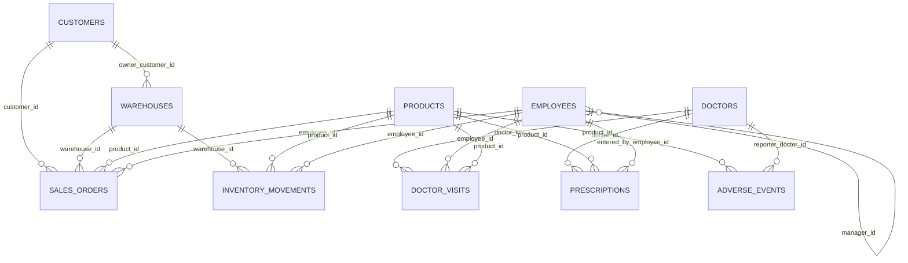

# ER-схеми: джерело → silver → gold

Три діаграми відповідають трьом шарам задеплоєної моделі. Порядок завантаження й повний
перелік залежностей — у [`silver_dependencies.md`](silver_dependencies.md).

---

## 1. Джерело: Pharma ERP (Azure SQL, схема `erp`)

FK у джерелі не оголошені — усі зв'язки логічні, тому частина посилань веде «в нікуди»
(це навмисно, silver їх обробляє).



Особливості: `PRODUCTS` має кілька рядків на `product_id` (історія цін), `CUSTOMERS`
і `DOCTORS` містять дублі однієї сутності під різними кодами, `ADVERSE_EVENTS` —
кілька версій одного кейсу.

---

## 2. Silver (`whsilver.dwh`)

23 виміри, 6 Ref-таблиць, 5 фактів. Факти посилаються **тільки на durable keys** (`SK…KeyID`),
причому на сутності, що мають Ref-шар, — через `Ref*`, який зводить коди джерела до «золотого» запису.

```mermaid
erDiagram
    DimDate            ||--o{ FctSales : SKDateID
    DimOrderStatus     ||--o{ FctSales : SKOrderStatusKeyID
    DimCurrency        ||--o{ FctSales : SKCurrencyKeyID
    RefProduct         ||--o{ FctSales : SKRefProductKeyID
    RefClientAccount   ||--o{ FctSales : SKRefClientAccountKeyID
    RefWarehouse       ||--o{ FctSales : SKRefWarehouseKeyID
    RefEmployee        ||--o{ FctSales : SKRefEmployeeKeyID

    RefProduct         ||--o{ FctInventoryMovement : SKRefProductKeyID
    RefWarehouse       ||--o{ FctInventoryMovement : SKRefWarehouseKeyID
    RefEmployee        ||--o{ FctInventoryMovement : SKRefEmployeeKeyID
    RefMovementType    ||--o{ FctInventoryMovement : SKRefMovementTypeKeyID
    DimDate            ||--o{ FctInventoryMovement : SKDateID

    RefDoctor          ||--o{ FctVisit : SKRefDoctorKeyID
    RefEmployee        ||--o{ FctVisit : SKRefEmployeeKeyID
    RefProduct         ||--o{ FctVisit : SKRefProductKeyID
    DimActivityType    ||--o{ FctVisit : SKActivityTypeKeyID
    DimDate            ||--o{ FctVisit : SKDateID

    RefDoctor          ||--o{ FctPrescription : SKRefDoctorKeyID
    RefProduct         ||--o{ FctPrescription : SKRefProductKeyID
    RefEmployee        ||--o{ FctPrescription : SKRefEmployeeKeyID
    DimDate            ||--o{ FctPrescription : SKDateID

    RefProduct         ||--o{ FctAdverseEvent : SKRefProductKeyID
    RefDoctor          ||--o{ FctAdverseEvent : SKRefDoctorKeyID
    DimAeSeriousness   ||--o{ FctAdverseEvent : SKAeSeriousnessKeyID
    DimAeOutcome       ||--o{ FctAdverseEvent : SKAeOutcomeKeyID
    DimReportSource    ||--o{ FctAdverseEvent : SKReportSourceKeyID
    DimRegion          ||--o{ FctAdverseEvent : SKRegionKeyID
    DimDate            ||--o{ FctAdverseEvent : SKDateID

    DimProduct         ||--o{ RefProduct : SKProductKeyID
    DimClientAccount   ||--o{ RefClientAccount : SKClientAccountKeyID
    DimDoctor          ||--o{ RefDoctor : SKDoctorKeyID
    DimEmployee        ||--o{ RefEmployee : SKEmployeeKeyID
    DimWarehouse       ||--o{ RefWarehouse : SKWarehouseKeyID
    DimMovementType    ||--o{ RefMovementType : SKMovementTypeKeyID

    DimManufacturer    ||--o{ DimProduct : SKManufacturerKeyID
    DimAtcClass        ||--o{ DimProduct : SKAtcClassKeyID
    DimChain           ||--o{ DimClientAccount : SKChainKeyID
    DimLegalEntity     ||--o{ DimClientAccount : SKLegalEntityKeyID
    DimCity            ||--o{ DimClientAccount : SKCityKeyID
    DimRegion          ||--o{ DimCity : SKRegionKeyID
    DimSpecialty       ||--o{ DimDoctor : SKSpecialtyKeyID
    DimLpu             ||--o{ DimDoctor : SKLpuKeyID
    DimTerritory       ||--o{ DimEmployee : SKTerritoryKeyID
    DimEmployee        ||--o{ DimEmployee : SKEmployeeManagerKeyID
    DimClientAccount   ||--o{ DimWarehouse : SKClientAccountOwnerKeyID
```



### Bus matrix silver

| Fct \ Dim | Date | Product | ClientAccount | Warehouse | Employee | Doctor | ActivityType | OrderStatus | MovementType | Currency | Region | AE-виміри |
|---|:--:|:--:|:--:|:--:|:--:|:--:|:--:|:--:|:--:|:--:|:--:|:--:|
| FctSales | ✔ | ✔ | ✔ | ✔ | ✔ | | | ✔ | | ✔ | | |
| FctInventoryMovement | ✔ | ✔ | | ✔ | ✔ | | | | ✔ | | | |
| FctVisit | ✔ | ✔ | | | ✔ | ✔ | ✔ | | | | | |
| FctPrescription | ✔ | ✔ | | | ✔ | ✔ | | | | | | |
| FctAdverseEvent | ✔ | ✔ | | | | ✔ | | | | | ✔ | ✔ |

Історизація: усі виміри SCD2 (`EndDate IS NULL` = поточна версія), крім `DimLpu` — він
переведений на SCD1 для демонстрації різниці підходів ([`scd1_demo.md`](scd1_demo.md)).

---

## 3. Gold (`whgold.dwh`)

Класична зірка без Ref-шару й версій: 6 денормалізованих вимірів і 7 агрегатів.
Місячні агрегати зв'язані з календарем через `MonthStartDate` (перший день місяця),
денний — через `SKDateID`.

```mermaid
erDiagram
    DimDate          ||--o{ AggSalesDaily : SKDateID
    DimProduct       ||--o{ AggSalesDaily : SKProductID
    DimClientAccount ||--o{ AggSalesDaily : SKClientAccountID
    DimEmployee      ||--o{ AggSalesDaily : SKEmployeeID
    DimWarehouse     ||--o{ AggSalesDaily : SKWarehouseID

    DimDate          ||--o{ AggSalesMonthly : MonthStartDate
    DimProduct       ||--o{ AggSalesMonthly : SKProductID
    DimEmployee      ||--o{ AggSalesMonthly : SKEmployeeID

    DimDate          ||--o{ AggVisitMonthly : MonthStartDate
    DimEmployee      ||--o{ AggVisitMonthly : SKEmployeeID
    DimProduct       ||--o{ AggVisitMonthly : SKProductID

    DimDate          ||--o{ AggPrescriptionMonthly : MonthStartDate
    DimProduct       ||--o{ AggPrescriptionMonthly : SKProductID

    DimDate          ||--o{ AggInventoryMonthly : MonthStartDate
    DimWarehouse     ||--o{ AggInventoryMonthly : SKWarehouseID
    DimProduct       ||--o{ AggInventoryMonthly : SKProductID

    DimDate          ||--o{ AggAdverseEventMonthly : MonthStartDate
    DimProduct       ||--o{ AggAdverseEventMonthly : SKProductID

    DimDate          ||--o{ AggPromoEffectMonthly : MonthStartDate
    DimProduct       ||--o{ AggPromoEffectMonthly : SKProductID
```



`AggPromoEffectMonthly` рахується не з фактів, а з трьох інших агрегатів
(продажі + візити + призначення), тому завантажується на окремому рівні.

Атрибути, яких у зірці немає окремими вимірами (регіон, спеціальність, тип активності,
серйозність), лежать текстовими колонками в самих агрегатах — це свідоме спрощення
для швидких зрізів.

---

## 4. Потік

```
Azure SQL [erp]  →  lhbronze.erp_erp  →  whsilver.dwh  →  whgold.dwh  →  PharmaSalesGold
   10 таблиць        1:1 копія            34 таблиці        13 таблиць     семантична модель
                     + Tech* колонки      SCD2/SCD1         агрегати       35 мір, синоніми
```
