# Silver level — Microsoft Fabric Warehouse (`whsilverad.dwh`)

Модель silver-рівня для джерела **Pharma ERP** (Azure SQL, схема `[erp]`), створеного
скриптами `01_ddl_azure_sql.sql` (DDL) та `02_generate_data_fixed.sql` (наповнення).

Конвенції неймінгу, технічних колонок і процедур завантаження — ті самі, що в
`grp-ctl-azure-dwh/fabric-migrations/flyway/migrations`.

---

## 1. Потік даних

```
Azure SQL [erp].*            ->  Bronze lakehouse                ->  Silver warehouse
(10 таблиць ERP)                 lhbronzead.pharma_erp.*             whsilverad.dwh.*
                                 (1:1 копія, без трансформацій)      (Dim / Ref / Fct)
```

Silver читає bronze **тільки через view** `dwh.v<ObjectName>`; таблиці наповнюються
процедурами `spUpsertSCDDimension` (виміри та Ref) і `spFullFct` (факти).

Очікуваний контракт bronze — таблиці з тими самими іменами й колонками, що в `[erp]`:
`PRODUCTS`, `CUSTOMERS`, `DOCTORS`, `EMPLOYEES`, `WAREHOUSES`, `SALES_ORDERS`,
`INVENTORY_MOVEMENTS`, `DOCTOR_VISITS`, `PRESCRIPTIONS`, `ADVERSE_EVENTS`
(включно з `row_id`, `created_at`, `updated_at`).

## 2. Конвенції

| Елемент | Правило |
|---|---|
| Схема | `whsilverad.dwh` |
| Вимір | `Dim<Entity>`; ключі `SK<Entity>ID` (версія рядка) + `SK<Entity>KeyID` (durable key) |
| Довідник маппінгу | `Ref<Entity>`; ключі `SKRef<Entity>ID` + `SKRef<Entity>KeyID`, плюс `SKSrcSystemKeyID` та `SK<Entity>KeyID` на "золотий" запис |
| Факт | `Fct<Entity>`; ключ `SKFct<Entity>ID`, посилання **тільки на `SK*KeyID`** |
| Джерельний view | `v<TableName>`, **перша колонка = натуральний ключ `Id`** (за нею процедура визначає NK) |
| Технічні колонки Dim/Ref | `StartDate`, `EndDate`, `IsDeleted`, `CreatedBy`, `ModifiedBy`, `CreatedAt`, `ModifiedAt` |
| Технічні колонки Fct | `CreatedBy`, `CreatedAt` |
| Історизація | SCD2: активна версія — `EndDate IS NULL`; зникнення в джерелі -> `IsDeleted = 1` |
| Unknown member | рядок `-1` у кожному Dim/Ref (+ `SKDateID = -1` у `DimDate`) |
| Значення за замовчуванням | текст -> `'N/A'`, ключ -> `-1` (усі `SK*KeyID` у view обгорнуті в `ISNULL(..., -1)`) |

## 3. Склад моделі

**Статичні виміри (керований словник, наповнюються міграцією, без view):**
`DimDate`, `DimSrcSystem`, `DimCurrency`, `DimAtcClass`, `DimMovementType`, `DimOrderStatus`.

**Виміри з джерела (SCD2, наповнюються `spUpsertSCDDimension`):**
`DimRegion`, `DimCity`, `DimTerritory`, `DimChain`, `DimLegalEntity`, `DimManufacturer`,
`DimProduct`, `DimClientAccount`, `DimSpecialty`, `DimLpu`, `DimDoctor`, `DimEmployee`,
`DimWarehouse`, `DimActivityType`, `DimAeSeriousness`, `DimAeOutcome`, `DimReportSource`.

**Reference-таблиці (ключ джерела -> durable key):**
`RefProduct`, `RefClientAccount`, `RefDoctor`, `RefEmployee`, `RefWarehouse`, `RefMovementType`.

**Факти:**

| Факт | Grain | Джерело |
|---|---|---|
| `FctSales` | рядок замовлення (`order_line_id`, дедупльований) | `SALES_ORDERS` |
| `FctInventoryMovement` | складський рух (`movement_id`) | `INVENTORY_MOVEMENTS` |
| `FctVisit` | візит/активність (`visit_id`) | `DOCTOR_VISITS` |
| `FctPrescription` | призначення (`prescription_id`) | `PRESCRIPTIONS` |
| `FctAdverseEvent` | версія кейсу (`ae_id` + `case_version`) | `ADVERSE_EVENTS` |

## 4. Bus matrix

| Fct \ Dim | Date | Product | ClientAccount | Warehouse | Employee | Doctor | ActivityType | OrderStatus | MovementType | Currency | Region | AE-виміри |
|---|:--:|:--:|:--:|:--:|:--:|:--:|:--:|:--:|:--:|:--:|:--:|:--:|
| FctSales | ✔ | ✔ | ✔ | ✔ | ✔ | | | ✔ | | ✔ | | |
| FctInventoryMovement | ✔ | ✔ | | ✔ | ✔ | | | | ✔ | | | |
| FctVisit | ✔ | ✔ | | | ✔ | ✔ | ✔ | | | | | |
| FctPrescription | ✔ | ✔ | | | ✔ | ✔ | | | | | | |
| FctAdverseEvent | ✔ | ✔ | | | | ✔ | | | | | ✔ | ✔ |

## 5. ER-схема (ключові зв'язки)

```mermaid
erDiagram
    DimDate            ||--o{ FctSales : SKDateID
    DimOrderStatus     ||--o{ FctSales : SKOrderStatusKeyID
    DimCurrency        ||--o{ FctSales : SKCurrencyKeyID
    RefProduct         ||--o{ FctSales : SKRefProductKeyID
    RefClientAccount   ||--o{ FctSales : SKRefClientAccountKeyID
    RefWarehouse       ||--o{ FctSales : SKRefWarehouseKeyID
    RefEmployee        ||--o{ FctSales : SKRefEmployeeKeyID

    RefProduct         ||--o{ FctInventoryMovement : SKRefProductKeyID
    RefWarehouse       ||--o{ FctInventoryMovement : SKRefWarehouseKeyID
    RefEmployee        ||--o{ FctInventoryMovement : SKRefEmployeeKeyID
    RefMovementType    ||--o{ FctInventoryMovement : SKRefMovementTypeKeyID
    DimDate            ||--o{ FctInventoryMovement : SKDateID

    RefDoctor          ||--o{ FctVisit : SKRefDoctorKeyID
    RefEmployee        ||--o{ FctVisit : SKRefEmployeeKeyID
    RefProduct         ||--o{ FctVisit : SKRefProductKeyID
    DimActivityType    ||--o{ FctVisit : SKActivityTypeKeyID
    DimDate            ||--o{ FctVisit : SKDateID

    RefDoctor          ||--o{ FctPrescription : SKRefDoctorKeyID
    RefProduct         ||--o{ FctPrescription : SKRefProductKeyID
    RefEmployee        ||--o{ FctPrescription : SKRefEmployeeKeyID
    DimDate            ||--o{ FctPrescription : SKDateID

    RefProduct         ||--o{ FctAdverseEvent : SKRefProductKeyID
    RefDoctor          ||--o{ FctAdverseEvent : SKRefDoctorKeyID
    DimAeSeriousness   ||--o{ FctAdverseEvent : SKAeSeriousnessKeyID
    DimAeOutcome       ||--o{ FctAdverseEvent : SKAeOutcomeKeyID
    DimReportSource    ||--o{ FctAdverseEvent : SKReportSourceKeyID
    DimRegion          ||--o{ FctAdverseEvent : SKRegionKeyID
    DimDate            ||--o{ FctAdverseEvent : SKDateID

    DimProduct         ||--o{ RefProduct : SKProductKeyID
    DimClientAccount   ||--o{ RefClientAccount : SKClientAccountKeyID
    DimDoctor          ||--o{ RefDoctor : SKDoctorKeyID
    DimEmployee        ||--o{ RefEmployee : SKEmployeeKeyID
    DimWarehouse       ||--o{ RefWarehouse : SKWarehouseKeyID
    DimMovementType    ||--o{ RefMovementType : SKMovementTypeKeyID

    DimManufacturer    ||--o{ DimProduct : SKManufacturerKeyID
    DimAtcClass        ||--o{ DimProduct : SKAtcClassKeyID
    DimChain           ||--o{ DimClientAccount : SKChainKeyID
    DimLegalEntity     ||--o{ DimClientAccount : SKLegalEntityKeyID
    DimCity            ||--o{ DimClientAccount : SKCityKeyID
    DimRegion          ||--o{ DimCity : SKRegionKeyID
    DimSpecialty       ||--o{ DimDoctor : SKSpecialtyKeyID
    DimLpu             ||--o{ DimDoctor : SKLpuKeyID
    DimTerritory       ||--o{ DimEmployee : SKTerritoryKeyID
    DimEmployee        ||--o{ DimEmployee : SKEmployeeManagerKeyID
    DimClientAccount   ||--o{ DimWarehouse : SKClientAccountOwnerKeyID
```



## 6. Як silver закриває дефекти джерела

Скрипт `02_generate_data_fixed.sql` навмисно генерує "брудні" дані. Що з ними робить silver:

| Дефект джерела | Обробка в silver |
|---|---|
| SCD2-версії в `PRODUCTS` (кілька рядків на `product_id`) | `vDimProduct` бере актуальну версію (`ROW_NUMBER` по `updated_at DESC`); історію веде вже сам SCD2 виміру |
| Дублі клієнтів (`CST-9xxxx` з тим самим ЄДРПОУ) | golden record за ЄДРПОУ; усі `customer_id` мапляться на нього через `RefClientAccount` (`IsGoldenRecord`, `DimClientAccount.SrcDuplicateCnt`) |
| Дублі лікарів (той самий ПІБ, інший `doctor_id`) | golden record за ПІБ + ЛПУ; маппінг у `RefDoctor` |
| Рядкові дублікати у фактах | дедуп `ROW_NUMBER` по бізнес-ключу + прапорець `IsSrcDuplicate` |
| Orphan-ключі (`CST-7xxxxx`, `WH-9xx`, `DOC-7/8xxxxx`) | `LEFT JOIN` + `ISNULL(..., -1)` -> посилання на unknown member |
| Укр./англ. `movement_type` | `RefMovementType` зводить сирі значення до канонічних `IN/OUT/TRANSFER/WRITEOFF`; знак кількості — `DimMovementType.QtySign` -> `FctInventoryMovement.QtySigned` |
| Некоректні дати (2019, 2028) | зберігаються, але позначені `FctSales.IsPeriodOutOfRange` |
| Розсинхрон `line_amount` | `FctSales.IsAmountConsistent` (порівняння з `Qty * UnitPrice * (1 - Discount)`) |
| Аномальні кількості (> 500k) | `FctInventoryMovement.IsQtyOutlier` |
| Битий ATC (`XX123`) | `DimProduct.IsAtcCodeValid = 0`, `SKAtcClassKeyID = -1` |
| Логічна помилка AE (`Critical` + `Recovered`) | `FctAdverseEvent.IsLogicalError` |
| NULL-и (`region`, `brand_name`, `specialty`, `outcome`) | `'N/A'` в атрибутах, `-1` у ключах |

Дані **не видаляються** — silver позначає проблеми прапорцями, рішення про фільтрацію
ухвалює gold.

## 7. Порядок завантаження

Одна процедура-оркестратор:

```sql
EXEC [dwh].[spSilverFullLoad] @load_id = 'manual_full_load';
```

Порядок усередині (важливий через залежності між view та вже завантаженими таблицями):

1. `DimRegion`, `DimTerritory`, `DimChain`, `DimManufacturer`, `DimSpecialty`, `DimLegalEntity`,
   `DimActivityType`, `DimAeSeriousness`, `DimAeOutcome`, `DimReportSource`
2. `DimCity`, `DimLpu`
3. `DimProduct`, `DimClientAccount`, `DimDoctor`, `DimEmployee` (двічі — self-reference на керівника)
4. `RefProduct`, `RefClientAccount`, `RefDoctor`, `RefEmployee`, `RefMovementType`,
   далі `DimWarehouse` (потребує `RefClientAccount`) і `RefWarehouse`
5. факти: `FctSales`, `FctInventoryMovement`, `FctVisit`, `FctPrescription`, `FctAdverseEvent`

## 8. Міграції

| Файл | Вміст |
|---|---|
| `V260819.1000__silver_init_creation_create_table.sql` | усі таблиці Dim / Ref / Fct + `DimDate` |
| `V260819.1010__silver_init_creation_insert.sql` | рядки `-1` + статичні виміри |
| `V260819.1020__silver_init_creation_create_view.sql` | усі `v*` view над bronze |
| `V260819.1030__silver_init_creation_create_prc.sql` | `spSchemaValidation`, `spUpsertSCDDimension`, `spFullFct` |
| `V260819.1040__silver_insert_DimDate.sql` | наповнення календаря |
| `V260819.1050__silver_create_prc_full_load.sql` | `spSilverFullLoad` |
| `V260820.0930__silver_alter_fct_views_src_system.sql` | fix: `vFct*` беруть `SKSrcSystemKeyID` через CTE з агрегатом, а не `CROSS JOIN` |

Іменування: `V<YYMMDD>.<HHMM>__<опис>.sql`, `flyway.outOfOrder=true`, кожна міграція ідемпотентна.

## 9. Відмінності від прод-репозиторію

* `spFullFct` тут — простий `TRUNCATE + INSERT`; у проді використовується варіант зі swap-таблицею
  (`Fct*_new` -> `sp_rename`), щоб уникнути вікна порожньої таблиці.
* Одна джерельна система (`DimSrcSystem.Id = 1`, `PharmaERP`), тому `Ref*` мають рівно один
  рядок на ключ джерела; структура збережена для сумісності з мультиджерельним завантаженням.
* Провіженінг схем bronze-лейкхаусу (`.sh`-міграції з `lh_provisioner.py`) не входить у цей приклад.
